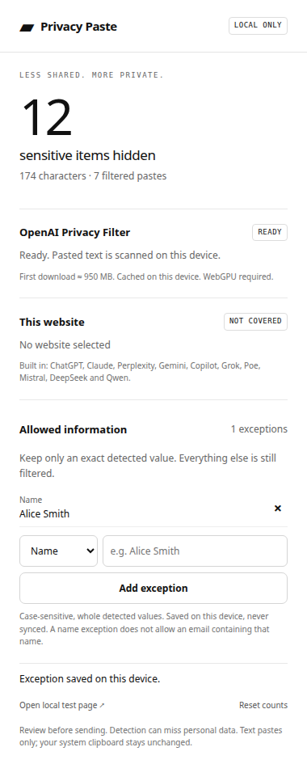

# Privacy Paste

Privacy Paste is a Chrome and Brave extension that redacts personal information before it reaches AI chat websites. It runs [OpenAI Privacy Filter](https://huggingface.co/openai/privacy-filter) locally with WebGPU—no API key, account, or remote inference service required.



## Features

- Intercepts text pastes on ChatGPT, Claude, Perplexity, Gemini, Copilot, Grok, Poe, Mistral, DeepSeek, and Qwen
- Detects names, emails, phone numbers, addresses, dates, private URLs, account numbers, and secrets
- Exact-value, category-specific exceptions for information you intentionally want to share
- Local counts of filtered pastes, hidden spans, and hidden characters
- Blocks the paste if the model is unavailable, the scan fails, or the field changes during scanning
- Leaves the system clipboard unchanged
- Supports additional HTTPS AI websites through an optional per-site permission

## Install from source

Requires Node.js 20+ and a current desktop Chrome or Brave with WebGPU enabled.

```sh
npm ci
npm run build
```

Then:

1. Open `chrome://extensions` or `brave://extensions`.
2. Enable **Developer mode**.
3. Click **Load unpacked** and select the generated `dist` folder.
4. Open Privacy Paste and click **Load local model**.
5. Wait for **READY**, then refresh any AI website tabs already open.

The first model download is approximately 950 MB and is cached by the browser. There is deliberately no remote-inference fallback.

## Try it safely

Open **Privacy Paste → Open local test page**, copy the fictional sample, and paste it into the provided fields. A result should look like:

```text
My name is [NAME] and my email is [EMAIL].
```

Add the exception **Name → Alice Smith** and repeat. The exact detected name should remain while other detected information stays hidden.

## How it works

The content script cancels the original paste synchronously at `document_start`. The text is sent through extension-only messaging to a dedicated worker, classified locally using Transformers.js and WebGPU, then replaced with markers such as `[NAME]` and `[EMAIL]`. Only the filtered text is inserted or dispatched to the website.

Transformers.js 4.2 does not return character offsets for this pipeline. Privacy Paste therefore requires every decoded model group—including background text—to reconstruct the clipboard text exactly and in order. Any mismatch blocks insertion rather than risking an incorrect redaction.

Whitelist rules are applied after classification. They match the complete detected value and category, case-sensitively; they are not prompts, substrings, wildcards, or regular expressions.

## Privacy and limits

- Clipboard text is held temporarily in extension memory and is not persisted, synced, or logged by application code.
- Only model assets are fetched from Hugging Face. JavaScript and ONNX Runtime WASM are packaged with the extension.
- Rules and aggregate counts stay in `chrome.storage.local` on the device.
- Inputs are limited to 16,000 JavaScript characters and 2,048 model tokens.
- Text pastes are covered. Typing, drag-and-drop, file uploads, autofill, images, and existing field content are not scanned.
- The model can miss personal data or redact benign text, especially outside English. Review filtered text before sending.
- This is a data-minimization aid, not a guarantee of anonymization.

## Development

```sh
npm test
npx playwright install chromium
npm run test:browser
```

`npm run test:model` runs an optional real-model WebGPU test and downloads the model. See [VALIDATION.md](VALIDATION.md) for completed checks and [THIRD_PARTY_NOTICES.md](THIRD_PARTY_NOTICES.md) for dependency licenses and notices.

## License

MIT. OpenAI Privacy Filter and Transformers.js are Apache-2.0 licensed; ONNX Runtime is MIT licensed.
